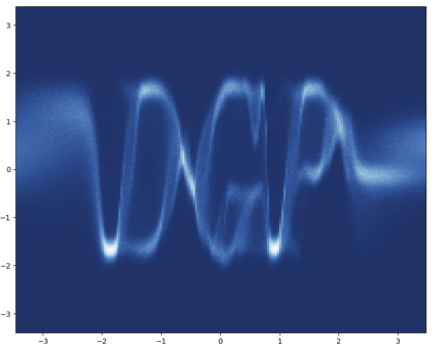
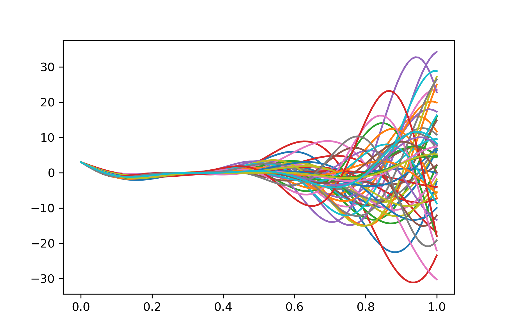
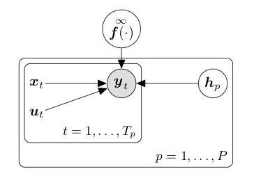
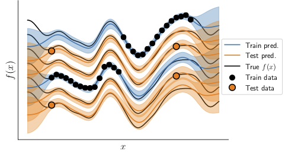

# Discriminative model

- The aim is to learn a functional relationship:
$$
y = f(x) + \epsilon
$$

- There are multiple ways to parametrize a functional relationship.
- For example, a basis function model:
$$
f(x) = \sum_{k} w_k \phi_k(x), \quad w_k \sim \mathcal{N}(0, 1)
$$
where $\{\phi_k(x)\}_k$ denotes the set of basis functions.

# Gaussian process

- Gaussian process has *infinite* number of basis functions.
$$
p(\yV|\xM) = \gaussianDist{\yV}{0}{\K}
$$
where the covariance matrix is computed from the set of inputs $\xM$ using the kernel function $k(\cdot, \cdot)$.

# A hybrid discriminative model

- A discriminative model with a latent input
$$
p(\yV | \xM, \hM) p(\hM)
$$

- To capture the information missing from $\xM$
  - Missing information in individual data points: flexible uncertainty
  - Missing information shared across multiple data points: multi-output, multi-task, meta-model

# Missing information in individual data points

- One latent variable per data point:
$$
\yV = (y_1, \dots, y_N), \quad \xM = (\xV_1, \ldots, \xV_N), \quad \hM = (\hV_1, \ldots, \hV_N).
$$
$$
y_n = f(\xV_n ,\hV_n) + \epsilon
$$

{ width=30% }

- This idea has been applied to BNN [@DepewegEtAl2018] and DGP.

# Missing information shared across multiple data points

- Clustering of GP: [@HensmanEtAl2015], [@LawrenceEtAl2018]

- Multi-output GP with latent space: [@DaiEtAl2017]

# A Toy Problem: The Braking Distance of a Car

- To model the braking distance of a car in a *completely data-driven* way.
  - Input: the speed when starting to brake
  - Output: the distance that the car moves before fully stopped
  - We know that the braking distance depends on the friction coefficient.
  - We can conduct experiments with a set of different tyre and road conditions

{ width=30% }

# A non-parametric regression

- GP is the natural choice for such a non-parametric regression problem.

{ width=50% }

# One shot learning

- What if we drive on a different road or changing the tyres?
- Do we need to completely redo the fitting?

{ width=50% }

# Assume a latent variable in the model

- Assume a latent variable representing the road/car condition.
$$
y_{n,c} = f(\xV_{n,c}, \hV_{c}) + \epsilon, \quad f \sim GP, \quad \hV_c \sim \mathcal{N}(0,\I)
$$

{ width=45% }
{ width=28% }

# A meta-model

- Modeling beyond a single task has been the focus.

- A generative model for tasks

- A combination of discriminative and generative model

# View a task as a data point

- The data are collected from multiple tasks:
$$
\yV = (\yV_1, \dots, \yV_C), \quad \text{where}\quad \yV_c = (\yV_{1,c}, \dots, \yV_{N_c, c})
$$
$$
\xM = (\xM_1, \dots, \xM_C), \quad \text{where}\quad \xM_c = (\xM_{1,c}, \dots, \xM_{N_c, c})
$$

- A generative model with a fancy likelihood (a discriminative model)
$$
p(\yV_1, \ldots, \yV_C | \xM_1, \ldots, \xM_C, \hV_1, \ldots, \hV_C) p(\hV_1, \ldots, \hV_C)
$$

<!--
# Example: Forrester Function

- Extend the Forrester function into a distribution of functions:
$$
f(x) = (ax-2)^2\sin(bx-4), \quad a \sim \mathcal{N}(6, 1), \quad b \sim \mathcal{N}(12, 2).
$$

{ width=50% }

# Learn a latent space of functions

- Collect a few data points from each function sample (task).

- Learn a latent space of the functions.

-->

# A generative model of functions

- Sample a new function
$$
p(y_*|\xV_*, \hV_*, \mathcal{D})
$$

- Posterior distribution of a new function with a few data points
$$
p(y_*|\xV_*, \mathcal{D}, \mathcal{D}_*) = \int p(y_*|\xV_*, \hV_*, \mathcal{D}, \mathcal{D}_*) p(\hV_* | \mathcal{D}, \mathcal{D}_*) \text{d}\hV_*
$$

# Some technical details

- Implement as Multi-output GP (MOGP)

    - Expand the input vector $\hat{\xV} = (\xV, \hV)$: $\K = k(\hat{\xM}, \hat{\xM})$.

    - Use multiplication of kernels: $\K = \K_x \K_h$, where $\K_x = k_x(\xM, \xM)$ and $\K_h = k_h(\hM, \hM)$.

    - If different tasks share the same set of $\xM$,
    $$
    \K = \K_x \otimes \K_h
    $$

# Applications

- Multi-task/Multi-output learning

- Meta-model for reinforcement learning [@SæmundssonEtAl2018]

- Meta-model for multi-task Bayesian optimization

- Meta learning

{ width=30% }
{ width=30% }

# References {.allowframebreaks}
